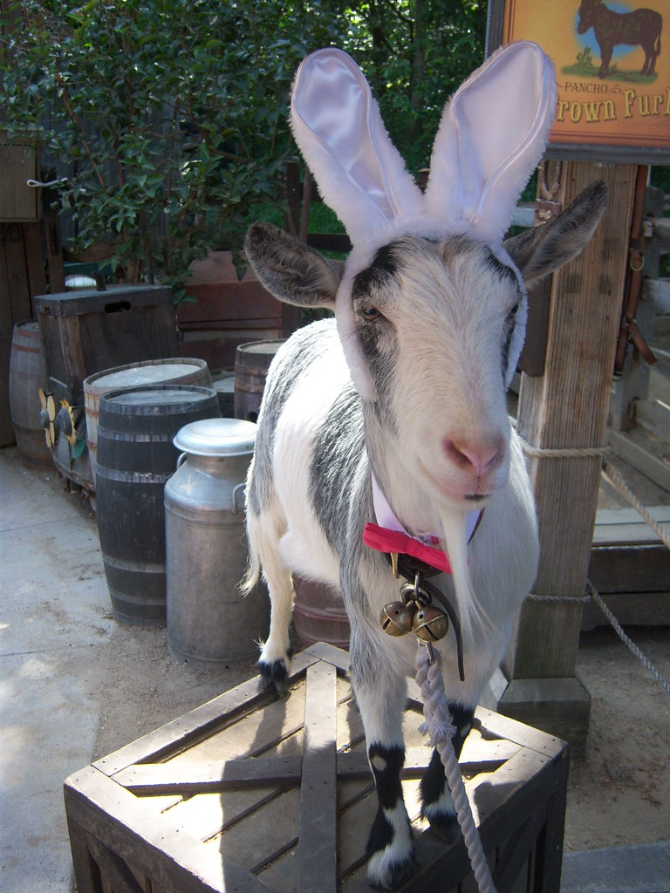

# Bunnygoat

\
(Copyright [Loren Javier](https://www.flickr.com/photos/lorenjavier/3449805786))

[](https://xn--gckvb8fzb.com/contact/)


Bunnygoat is a script that imports [Bunny](https://bunny.net?ref=mcdwaycxf4)
(reflink, thank you!) log files into
[GoatCounter](https://github.com/arp242/goatcounter), turning it into a
server-side-only, poor man's analytics tool. It does so by using a
[patched version](https://github.com/arp242/goatcounter/pull/798) of GoatCounter
that supports importing timestamps in UNIX millisecond format.

## Usage

You need two API keys:

- Your Bunny API key to download the logfiles from Bunny
- Your GoatCounter API key to upload them into GoatCounter

```sh
$ export \
  BUNNY_API_KEY='xxx' \
  BUNNY_DOMAIN='example.com' \
  BUNNY_PULLZONE_ID='1234567' \
  BUNNY_LOG_DATE='05-07-25' \
  GOATCOUNTER_API_KEY='yyy' \
  GOATCOUNTER_SITE='https://stats.example.com'
$ bunnygoat \
  "$BUNNY_API_KEY" \
  "$BUNNY_DOMAIN" \
  "$BUNNY_PULLZONE_ID" \
  "$BUNNY_LOG_DATE" \
  "$GOATCOUNTER_API_KEY" \
  "$GOATCOUNTER_SITE"
```

Bunnygoat also supports passing additional arguments to the `goatcounter import`
command, by appending them after the last argument:

```sh
$ bunnygoat \
  "$BUNNY_API_KEY" \
  "$BUNNY_DOMAIN" \
  "$BUNNY_PULLZONE_ID" \
  "$BUNNY_LOG_DATE" \
  "$GOATCOUNTER_API_KEY" \
  "$GOATCOUNTER_SITE" \
  -exclude static \
  -exclude redirect \
  -exclude 'path:glob:/{buttons,css,fonts,favicons}/**' \
  -exclude 'path:glob:/**.{gif,png,jpg,css,js}'
```

It is possible to create a cron job that runs the command periodically to import
data from BunnyCDN into GoatCounter.
